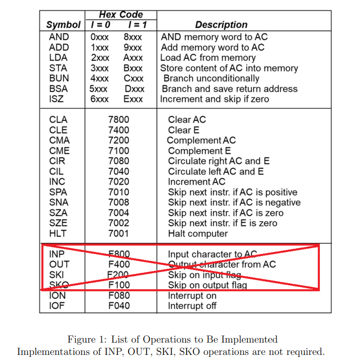

# Basic_Computer
 Designing a Basic Computer with Verilog

# Description
In this repo, I designed Basic Computer I (Mano's Basic Computer I) using
Verilog. Then cocotb is used to simulate the design.

# Instruction Set

# Interrupt Cycle (No nested interrupt)
<pre>
To test the interrupt cycle, I also added the last two instructions to my assembly program as follows:

Memory Address(dec)     Instruction     Machine Code(hex)   Comment 

1                       BUN             4064                // go to main routine at 100
109                     ION             F080                //enable interrupt
110                     INC             7020                // dummy instr to set FGI
</pre>

# Example Test Procedure (Assembly)
<pre>
Memory Address(dec)     Instruction     Machine Code(hex)   Comment

100                      CLA            7800
101                      LDA            20C8                //load AC from location 200
102                      ADD            10C9                //add AC with location 201
103                      AND I          80CA                //and AC indirect location 202
104                      CMA            7200                // complement AC
105                      STA            3190                //store AC to location 400
106                      ISZ            6190                //check the data at 400 and inc it
107                      BSA            51F4                //go location 500(1) and save PC
108                      INC            7020                //last inst after subroutine back
200                      ---            1100                // data for LDA
201                      ---            0011                // data for ADD
202                      ---            012C                //directs to 300
300                      ---            1110                //data for AND I
501                      LDA I          A320                //load AC indirect location 800
502                      CIL            7040                //CIL AC
503                      BUN I          C1F4                //back by indirect location 500
800                      ---            0190                //directs to 40
</pre>